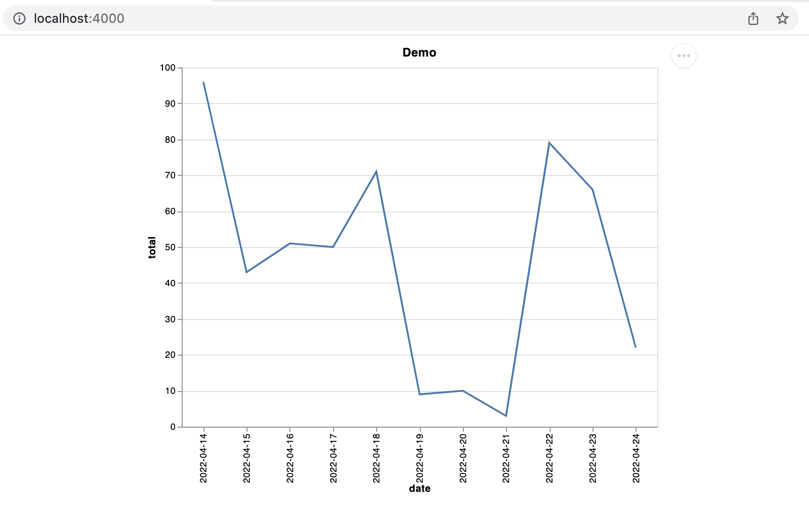

# Phoenix, Vegalite and you - A quick guide on how to use Vegalite with Phoenix LiveView

This has the intent to show a really basic use case on how to use Vegalite in a LiveView project. We will only focus on the basics (show a graph).

This example was based on the source code from https://github.com/livebook-dev/livebook but simplified for an easier learning experience.

## What was the setup?
To setup your project do the following
1. Create a new project `mix phx.new vegalite --live --no-ecto`
1. Access your assets directory `cd assets`
1. Create a package.json file `npm init --force`
1. Install required JS dependencies `npm i --save vega vega-embed vega-lite`
1. Add `{:vega_lite, "~> 0.1"}` to your `mix.exs`

## Prepare your JS code
Create a new file called `assets/js/vegalite.js`

Create a constant called VegaLite to be exported and prepared your hook. You can check more about JS hooks with https://hexdocs.pm/phoenix_live_view/js-interop.html#client-hooks-via-phx-hook

We're going to focus only on creating the graphic but you could add more events like updating, deleting, etc.
```js
import vegaEmbed from "vega-embed";
const VegaLite = {
    mounted() {
        // This element is important so we can uniquely identify which element will be loaded
        this.props = { id: this.el.getAttribute("data-id") };
        // Handles the event of creating a graph and loads vegaEmbed targetting our main hook element
        this.handleEvent(`vega_lite:${this.props.id}:init`, ({ spec }) => {
            vegaEmbed(this.el, spec)
                .then((result) => result.view)
                .catch((error) => console.error(error));
        });
    },
};

export default VegaLite;
```

Finally on your `assets/js/app.js` you can load this hook into your liveview setup
```js
import "phoenix_html"
import { Socket } from "phoenix"
import { LiveSocket } from "phoenix_live_view"
import VegaLite from "./vegalite";

let csrfToken = document.querySelector("meta[name='csrf-token']").getAttribute("content")
// Import and load the new hook
let hooks = { VegaLite }
let liveSocket = new LiveSocket("/live", Socket, { params: { _csrf_token: csrfToken }, hooks })

liveSocket.connect()

window.liveSocket = liveSocket
```

## Jump into your Phoenix code

Then create your component that will have the element that will retain the Vegalite embedded graph. I will detail what happens in the comments so you can follow the pipeline of operatinons.

More options can be explored in https://vega.github.io/vega-lite/docs/ but it can be quite tricky since the docs are not that easy to search.

``` elixir
defmodule VegaliteDemoWeb.Live.Graph do
  use VegaliteDemoWeb, :live_component
  @impl true
  def update(_, socket) do
    spec =
      VegaLite.new(title: "Demo", width: :container, height: :container, padding: 5)
      # Load values. Values are a map with the attributes to be used by Vegalite
      |> VegaLite.data_from_values(fake_data())
      # Defines the type of mark to be used
      |> VegaLite.mark(:line)
      # Sets the axis, the key for the data and the type of data
      |> VegaLite.encode_field(:x, "date", type: :nominal)
      |> VegaLite.encode_field(:y, "total", type: :quantitative)
      # Output the specifcation
      |> VegaLite.to_spec()

    socket = assign(socket, id: socket.id)
    {:ok, push_event(socket, "vega_lite:#{socket.id}:init", %{"spec" => spec})}
  end

  @impl true
  def render(assigns) do
    # Here we have the element that will load the embedded view. Special note to data-id which is the
    # identifier that will be used by the hooks to understand which socket sent want.

    # We also identify the hook that will use this component using phx-hook.
    # Refer again to https://hexdocs.pm/phoenix_live_view/js-interop.html#client-hooks-via-phx-hook
    ~H"""
    <div style="width:80%; height: 500px" id="graph" phx-hook="VegaLite" phx-update="ignore" data-id={@id}/>
    """
  end

  defp fake_data do
    today = Date.utc_today()
    until = today |> Date.add(10)

    Enum.map(Date.range(today, until), fn date ->
      %{total: Enum.random(1..100), date: Date.to_iso8601(date), name: "potato"}
    end)
  end
end

```

Finally we load this component as any normal LiveView component into our page (lib/vegalite_demo_web/live/page.ex).

## That is it!

That's it! In summary, we created a JS Webhook that allowed us to push a Vegalite specification to an HTML element from a LiveView component! And it all resulted in drawing our graph:


## Kudos

Big kudos to the following projects that enabled me to have so much fun and build a ton of interesting stuff!
* https://github.com/livebook-dev/livebook
* https://github.com/livebook-dev/vega_lite
* https://github.com/vega/vega-lite

## Notes
This project was built with the base project above but was heavily modified to simplify the code for easier learning.
